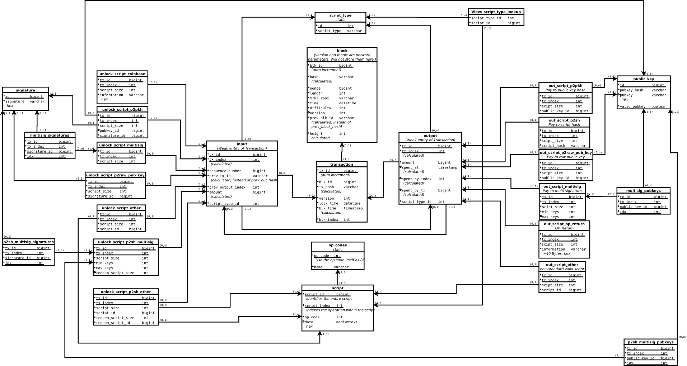

# Blockchain to Database

Blockchain to Database (Blk2DB) is a software to convert the Bitcoin Blockchain
into a relational database. The design of the database is flexible enough to
allow you to query virtually any aspect of the data within the blockchain.

Note that this software is not a Bitcoin client. It can not retrieve the
blockchain on it's own, so you will need a Bitcoin client and an up-to-date topy
of the blockchain.

## Live Demo

We have a live demo at [BlkChnQrs.org](https://blkchnqrs.org) where you can try
out the database. There are instances for both [mainnet](https://mainnet.blkchnqrs.org)
and [testnet3](https://testnet3.blkchnqrs.org). Use these credentials to login:

 * **username:** pubweb
 * **password:** privweb

## Database Schema

If you're looking at the database and feeling lost, have a look at the database
schema.



## User manual

This README is supposed to be a manual for both users and developers. Here's a
table of content:

 * [Requirements](#requirements)
   * [Software components](#software-components)
   * [Compile requirements](#compile-requirements)
 * [Configuration](#configuration)
   * [db.properties](#dbproperties)
   * [blockchain.properties](#blockchainproperties)
   * [flyway.properties](#flywayproperties)
   * [test_db.properties](#test_dbproperties)
   * [Configuring MariaDB](#configuring-mariadb)
     * [WARNING](#warning)
   * [Using InnoDB instead](#using-innodb-instead)
 * [Testing / Development setup](#testing--development-setup)
   * [Flyway](#flyway)
   * [Compiling and running the software](#compiling-and-running-the-software)
 * [Production use](#production-use)
   * [Flyway](#flyway)
   * [Running the software](#running-the-software)
   * [Migration from MEMORY to InnoDB storage engine](#migration-from-memory-to-innodb-storage-engine)
   * [fileMap](#filemap)
   * [Cronjob](#cronjob)
 * [Policy of crashing](#policy-of-crashing)
 * [Webinterface](#webinterface)
 * [License](#license)

## Requirements

To run the software, you will need a couple of software components, that you can
find listed below. Please note that if you plan on loading in the entire Bitcoin
Mainnet Blockchain, you will also want a very fast computer with a fast
database. We have done our initial readin to an in-memory MariaDB database and
it still took almost 10 days.

### Software components

 * [Java 8](http://openjdk.java.net/install/index.html)
 * [Flyway](https://flywaydb.org/)
 * [MariaDB 10.1+](https://mariadb.org/)

To retrieve and update the blockchain, you will also want a

 * [Bitcoin client](https://bitcoinclassic.com/)

### Compile requirements

If you want to build the software yourself, or work with it, you will need a
couple of additional tools

 * [Java 8 compiler](http://openjdk.java.net/install/index.html)
 * [Maven](https://maven.apache.org/)

You will probably also want

 * [Git](https://git-scm.com/)

However, if you'll be using Maven, you won't necessarily need Flyway.

## Configuration

There are a couple of important configuration files for Blk2DB: 

 * Database configuration [db.properties](src/main/resources/db.properties)
 * Blockchain configuration [blockchain.properties](src/main/resources/blockchain.properties)
 * Flyway configuration [flyway.properties](src/main/resources/flyway.properties)

And then there are also these:

 * Configuration for Unit tests [test_db.properties](src/main/resources/test_db.properties)
 * Log4j connfiguration [log4j2.xml](src/main/resources/log4j2.xml)

All of them can be found in [src/main/resources/](src/main/resources). If you're
working with the [Development setup](#testing--development-setup) you can edit
them in place. If, however, you're working in a [production
environment](#production-use) you will probably want to copy them out either to
`/etc/blockchain2database/` or into the current working directory.

Let's have a quick look at each of the configuration files and their content.

### db.properties
This file is used by the software to connect to the database. Here are the
values you should set in this file:

 * *dbdriver*: The driver to be used. You probably want to leave this at
   `org.mariadb.jdbc.Driver`
 * *dburl*: This is the JDBC URL to connect to the database, including both
   the host and the specific database
 * *user*: The database user. The user needs write access on the database
   configured in the dburl parameter
 * *password*: The user's password

### blockchain.properties
There are only two values here:

 * *directory*: The directory where the blockchain can be found. This is
  typically something like `/home/username/.bitcoin/blocks` or
  `/home/username/.bitcoin/testnet3/blocks`, depending on the network you're
  using
 * *testnet*: Boolean value, indicating wheter you want to operate on the
   testnet3 Bitcoin network. This is important because certain network
   parameters (such as address prefixes) depend on this setting

### flyway.properties
This is, as you've probably guessed already, the configuration file for Flyway.
You can configure Flyway's database user sepparately, since it will need to be
able to create a new database.

* *flyway.user*: The database user to be used by flyway
* *flyway.password*: That user's password

Note that in a production use, the variables `flyway.url` and `flyway.schemas`
are required whereas in the development setup, they are configured through
Maven's `pom.xml`.

<!-- TODO: rest of parameters -->

### test_db.properties
You will want to configure a different database for the unit tests than for the
rest of the program. This database will be whiped an recreated several times
during unit tests, so be careful with this setting.

Other than that, it is exactly the same as db.properties.

### Configuring MariaDB

Without any change, our scripts will create the database with the MEMORY storage
engine. Default MariaDB configurations do not allow large in-memory databases.
So you will need to edit `/etc/mysql/my.cnf` and set at least these variables:
```
max_heap_table_size=256G
tmp_table_size=256G
```

Whilest you are at it, you will probably also want to optimize some other
settings such as `key_buffer_size`, `sort_buffer_size` and others. General
optimization of a MariaDB instance is out of the scope of this REAME though.
Please consult a MariaDB optimization guide for that instead.

#### WARNING

Changing MariaDB configuration might require you to restart the service. The
MEMORY tables will get deleted on each restart of MariaDB. If you want to avoid
data loss, you have to create a Dump of the data first. If you have to regularly
restart the service or if you can't trust your MEMORY (for example, if you don't
have ECC Memory), you should probably use a different storage engine.

In our experience, it's a good idea, to use the MEMORY storage engine for the
initial readin of the data which can take a long time and causes high load on
the DBMS and then switch over to InnoDB for daily use.

### Using InnoDB instead

If you don't have the necessary amount of memory in your system, you can switch
to another MariaDB storage engine. We have tested the software to work with
InnoDB. If you do this, you will want your InnoDB database to be stored on an
SSD or similarly fast storage backend.

To change the storage engine, you have to edit the SQL files, since the used
storage engine is specified explicitly in each file. Note that you need to do
that *before* the first run of Flyway, otherwise you will confuse it.

You can change all the storage engine definitions with something like the
command below. Keep in mind, that this example is specific to [GNU
find](https://www.gnu.org/software/findutils/) and [GNU
sed](https://www.gnu.org/software/sed/) and the arguments might be different for
different implementations of these utilities (such as under BSD).
```
~$ find src/main/resources/db/migration/ -name "*.sql" -exec sed -i -e's/ENGINE\s*=\s*MEMORY/ENGINE = InnoDB/g' {} \
```

## Testing / Development setup

If you want to develop Blk2DB or if you just want to check it out and toy
around, you can use Maven for pretty much anything. However, if you plan on
using the software for more serious purposes, you should probably get an
executable version and write propper configuration files.

### Flyway

Once you have written the flyway config file, you can run Flyway straight from
Maven. Please note, that Flyway is *not* run during any of the regular Maven
build phases. This means that every time you want to run Flyway, you have to
specifically tell Maven to do so.

You can read details on the usage of Flyway on their
[website](https://flywaydb.org/), but for now, it will do if you can create and
delete the database:

```
# Initialize the database
~$ mvn flyway:migrate

# Delete the database
~$ mvn flyway:clean
```

If you want to do this on the testnet3 database rather than the mainnet databae,
simply add @testnet3 to the end of the command:

```
# Initialize the database
~$ mvn flyway:migrate@testnet3

# Delete the database
~$ flyway:clean@testnet3
```

### Compiling and running the software

You can compile the software using the usual Maven workflow. For the Unit tests
to work, the `test_db.properties` needs to be configured. The unit tests have
most of their Flyway configuration hardcoded in the
[DBManager.java](src/test/java/ch/bfh/blk2/bitcoin/blockchain2database/DBManager.java)
class, however, they still load the username and password used to administrate
the database from the flyway.properties. If you don't want to build the software
without running the tests in the process, use Maven like this:
```
mvn -Dmaven.test.skip=true clean package
```

Compiling the software with Maven will also produce an executable JAR.

You can use Maven to directly run the software. If you do that, you will
probably don't want to run the tests either. Once you have written all the
configuration files and readied the database, you can run the Blockchain to
Database software with this Maven command:
```
mvn -Dmaven.test.skip=true clean package exec:java -Dexec.mainClass="ch.bfh.blk2.bitcoin.blockchain2database.Blk2DB"

```

## Production use

To use the software in a production environment where you will want to run it in
regular intervals to update the database, we recommend you use an executable
JAR. The JAR gets created when you compile the software using Maven. It contains
all the configuration files, so you could edit them before compiling the
software. This however, is probably undesireable. To give you more flexibility,
we allow overriding the config files from the outside. To do that, either put
the [configuration files](#configuration), with the same name, in either
`/etc/blockchain2database` or in the current working directory. Blk2DB will
prefer configuration files in these locations over the one it has compiled in.
It also prefers those configuration files over the ones found in the classpath,
so you will want to keep your development environment and production environment
separate to avoid undesired effects when your development instance uses the
stable configuration.

### Flyway

After placing the configuration file in `/etc/blockchain2database` you will
want to edit it. Both `flyway.url` and `flyway.schemas` need to be set.

You should also pick a location to store the migration files. The migration
files for testnet3 and mainnet might interfere, so you need to make sure that
flyway only uses one set of migration files at a time. This is easiest when you
only use one schema. In that case, you can copy the files from the folders or
the entire folders
[mainnet](src/main/resources/db/migration/mainnet) or
[testnet3](src/main/resources/db/migration/testnet3) (depending on which schema
you want) and
[all](src/main/resources/db/migration/all) into one and the same directory, say
`/var/lib/blockchain2database/migration` and then specify this directory on the
flyway command line using the `-locations` option.

If however, you want both schemas, copy all three folders to the lodation and
then specify the ones you need on the command line. Since this last one is the
most complicated option, the example below shows how to call flyway with such a
configuration for the mainnet schema.


```
~$ flyway -configFile=/etc/blockchain2database/flyway.properties \
  -locations="filesystem:/var/lib/blockchain2database/migration/mainnet/,filesystem:/var/lib/blockchain2database/migration/all/" \
  migrate
```

### Running the software

Once all the configuration files are in place and the database has been intialized, running the software is as simple as typing

```
java -jar blockchain2database-1.0.jar
```

### Migration from MEMORY to InnoDB storage engine

We consider this a typical usecase:

 1. You create the database using the MEMORY storage engine
 2. You perform the initial readin of the blockchain into the MEMORY engine
    backed database
 3. You dump the database and reload it into an InnoDB
 4. You continue using the database on the InnoDB

The trick when doing that is to only run a subset of the flyway migrations for
the initial database setup.

```
# Initial run of flyway
~$ flyway -configFile=/etc/blockchain2database/flyway.properties \
  -locations="filesystem:/var/lib/blockchain2database/migration/" \
  -target=1.99 \
  migrate
```

```
# Init the database
java -jar blockchain2database-1.0.jar
```

```
# Dump the database
mysqldump --default-character-set=utf8 -h localhost -u root -p --databases mainnet > mainnet_$(date +%Ft%R).dmp
```

```
# Delete the database
~$ mysql -h localhost -u root -p 
...
> DROP DATABASE mainnet;
```

```
# Read in the dump into InnoDB backed tables
cat mainnet_2016-06-11t02\:38.dmp | sed -e's/ENGINE=MEMORY/ENGINE=InnoDB/g' | mysql --default-character-set=utf8 -h localhost -u root -p
```

```
# Run the rest of the flyway migrations
~$ flyway -configFile=/etc/blockchain2database/flyway.properties \
  -locations="filesystem:/var/lib/blockchain2database/migration/" \
  migrate
```

```
# Subsequential runs of the software to update the database
java -jar blockchain2database-1.0.jar
```

### fileMap

Inside the current working directory, the software will create a file called
`fileMap.serial`. This file contains serialized information on the blockchain
inside the .blk files. On every run after the initial one, having this file
around makes the software a lot faster.

If you delete the file, the software will continue working, however the next run
will take a lot longer. You should only delete the file when either you
cancelled readin of the database in an early state or when the .blk files got
replaced (instead of just getting updated).

### Cronjob

To keep your database up to date, you should run the Blockchain 2 Database
software regularly, say once every hour. The way to do that is probably via a
cronjob. You also want to make sure that no two instances of the software are
running at the same time.

Here is an example for a simple cronjob to run the software once every 30
minutes, using the `cronjob.sh` file from the [resources](src/main/resources)
folder (it has to be located in the same folder as the executable jar).

```
~$ crontabl -l
# m h  dom mon dow   command
5,35 * * * * cd /home/mainnet/blockchain2database/ && ./cronjob.sh
```

## Policy of crashing

It is important to us that the resulting database contains valid data. To ensure
this, we don't try to do anything fancy when we hit a problem while parsing the
blockchain. Instead, the application will just crash. On crash, the application
prints (hopefully) helpful information on where exactly the application crashed.
This allows a user to figure out what happened, fix the software (or file a bug
report) and then continue reading in the blockchain once the problem has been
resolved.

## Webinterface

In the webinterface branch, there is a simple webfrontend for the database. It
is based on [MyWebSQL](http://mywebsql.net/). All copyright for that software
stays with the original authors. The copyright stays the same (GPLv2 / GPLv3)
and our changes are released under the same license.

Our version of the software contains some minor changes. Particularly, it can
load .sql files from a directory on the server. We use this to present the user
some example queries. The setup procedure stays the same as for the original
software.

## License

This software is published under the [GNU PGL
v3](https://www.gnu.org/licenses/gpl-3.0.en.html). All copyright remains with
the original authors.
